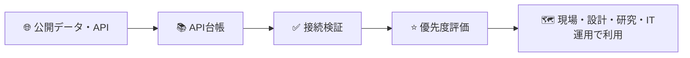
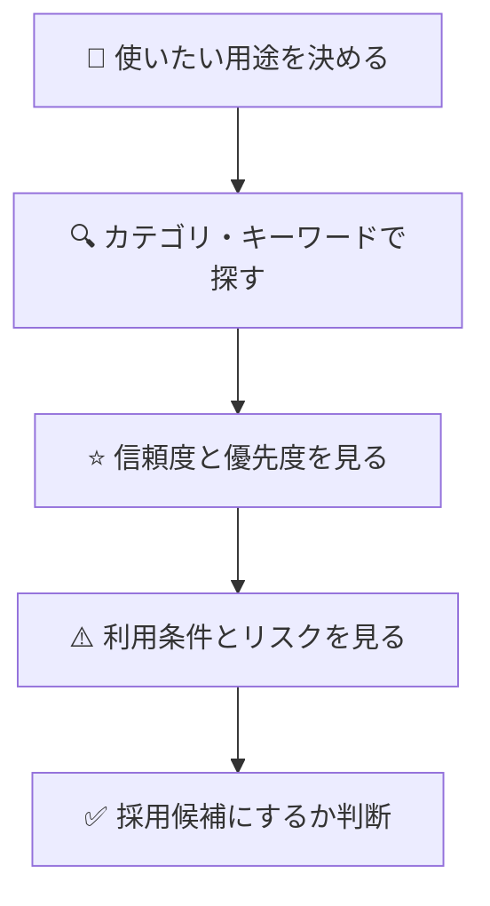
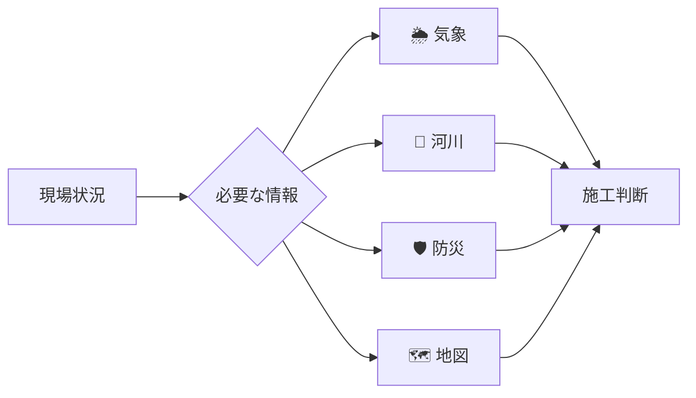
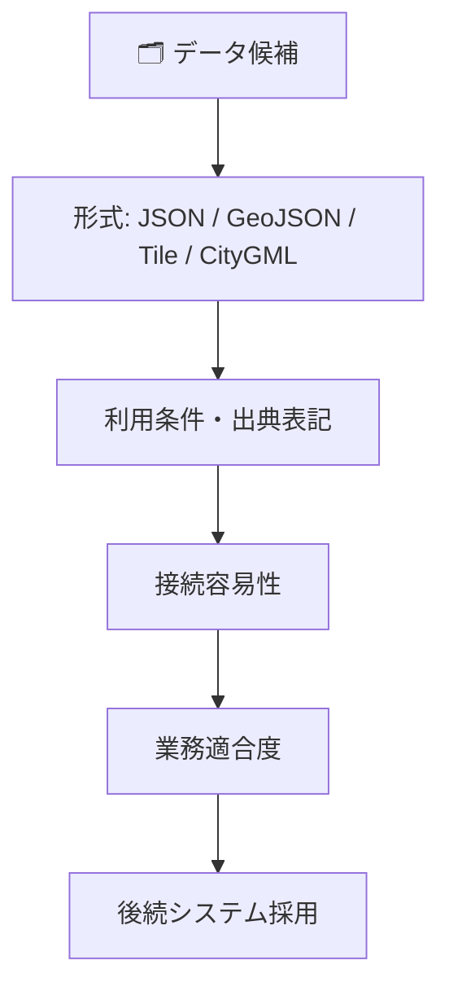
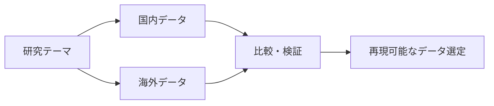
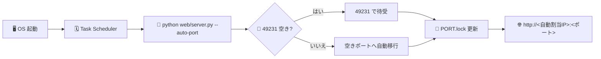
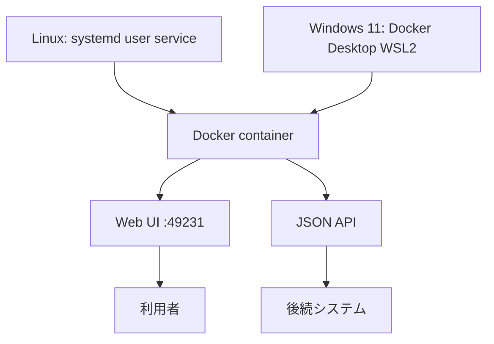
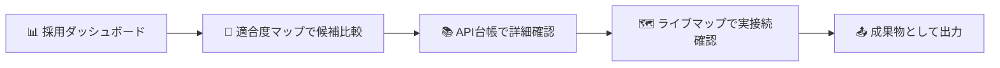

# Global Civil API Catalog

🏗️ **土木建設で使える国内外API・公開データを、現場判断・技術検討・研究・社内IT運用で迷わず使うための共通台帳です。**

🖥️ 本番プラットフォーム: **Windows（Task Scheduler による OS 起動時自動起動）**  
🔌 ポート: 既定 **49231**（競合時は空きポートへ自動移行し `deploy/PORT.lock` に記録）  
🌐 アクセスURL: `.\deploy\register-windows-service.ps1 -Status` で現在の自動割当IP・ポートを確認

## このシステムで分かること



| アイコン | 内容 |
|---|---|
| 📚 | API名、提供元、公式URL、データ形式を確認 |
| 🔑 | APIキー要否、認証方式、利用条件を確認 |
| ✅ | 接続検証結果、注意点、サンプルを確認 |
| ⭐ | 信頼度、接続優先度、本格利用候補を確認 |
| 📝 | 登録APIごとの利用説明と注意点を確認 |
| 📤 | Markdown、CSV、JSONで成果物を出力 |

## 読者別ガイド

### 🧭 非エンジニア・企画管理担当向け

この台帳は「どの公開データが使えそうか」を一覧で見るための入口です。APIやプログラムの知識がなくても、Web UIで提供元、用途、利用条件、信頼度を確認できます。

見る場所:
- `API Catalog`: 登録済みデータ50件の一覧
- `Latest Verification`: 接続確認の結果
- `Exports`: 会議資料や検討資料に使える出力ファイル

判断の流れ:



### 👷 土木建設現場管理・監督者向け

現場では、天気、河川、防災、地図、地形などを素早く確認する用途を想定しています。現場判断に直結するデータは、`本格利用候補` または `実装接続済` を優先してください。

主な確認ポイント:
- 🌦️ 気象: 気象庁 天気予報JSON
- 🌊 河川・水文: 水位、流量、雨量、USGS Water
- 🛡️ 防災: 洪水、土砂災害、津波、高潮
- 🗺️ 地図: 地理院標準地図、淡色地図、写真タイル



### 📐 土木建設技術者向け

設計、施工計画、候補地評価、リスク判定で使えるデータソースを整理しています。`connection_priority` が高いものから検証すると、後続システムへ組み込みやすくなります。

優先データ例:
- 地理院標準地図タイル: 共通ベースマップ
- 地理院標高タイル: 標高、勾配、地形確認
- 国土数値情報 行政区域: 位置判定、区域判定
- 国土数値情報 洪水浸水想定区域: 候補地リスク
- PLATEAU 3D都市モデル: BIM/CIM、3D都市検討

確認順:



### 🔬 土木建設研究者向け

国内外のデータ比較、研究テーマ探索、論文・実証実験のデータ選定に使えます。国内データだけでなく、NOAA、USGS、OpenStreetMap、OpenAQ、NASA系データも登録対象にしています。

研究用途の見方:
- 🌏 `region`: JP、US、Globalで比較
- 🧪 `data_formats`: 解析可能な形式か確認
- 📅 `update_frequency`: 時系列研究に使えるか確認
- ⚖️ `license_note`: 論文、発表、二次利用時の条件を確認



### 🖥️ 社内IT部門・システム運用管理者向け

このリポジトリは、後続システムが外部APIを安全に使うための基礎台帳です。APIキー、秘密情報、本番データは保存しません。本番は **Windows ネイティブ Python + Task Scheduler** で OS 起動時に自動起動します（Docker は開発・検証用の代替手段）。

**Linux（旧環境 / 参考。本番は Windows 完結）**

- 稼働URL: `http://192.168.0.185:49231`
- 起動方式: systemd ユーザーサービス (`global-civil-api-catalog-web.service`)
- コンテナ名: `global-civil-api-catalog-web`
- ヘルスチェック: `curl http://127.0.0.1:49231/api/health`

**Windows 11（ネイティブ Python + 自動起動 / 推奨）**

Docker 不要。OS 起動時に自動でWeb UIが立ち上がります。ポートは既定 `49231`、競合時は空きポートへ自動移行し `deploy/PORT.lock` に記録されます。

```powershell
# 起動サービス登録（OS起動時に自動起動）
.\deploy\register-windows-service.ps1 -Register

# 状態・アクセスURL確認
.\deploy\register-windows-service.ps1 -Status

# 登録解除
.\deploy\register-windows-service.ps1 -Unregister
```



**Windows 11（Docker Desktop WSL2 / 代替）**

```powershell
# 起動
.\deploy\start.ps1

# 停止
.\deploy\start.ps1 -Stop

# 開発コマンド（Makefile代替）
.\make.ps1 check
```

ダッシュボード: `http://localhost:49231`（同一端末から）/ 別端末からは `-Status` で表示される自動割当IPのURL  
詳細: [運用メモ](docs/operations.md)



## 🖥️ Web UI の主な画面

| 画面 | 内容 |
|---|---|
| 📊 採用ダッシュボード | スコア・接続ステータス・優先度の全体像。カテゴリ分布・最新検証結果を一望 |
| 🎯 採用適合度マップ | 横軸=事業適合度（business_fit）／縦軸=連携実装容易性（integration）／点サイズ=接続優先度 の散布図 |
| 📚 API台帳 | 検索・絞り込み・スコア比較と各APIの詳細・接続情報 |
| 🗺️ 地理空間ライブマップ | OpenStreetMap のタイルを実接続して表示。ベースマップは OSM 標準（OSM-TILE-001）／Humanitarian HOT（OSM-HOT）／CyclOSM（OSM-CYCLOSM）／地理院 淡色・標準 から選択。ハザード等のカタログタイルは重ね合わせレイヤとして透過度調整つきでオン/オフ |
| 📤 成果物エクスポート | Markdown / CSV / JSON の生成・ダウンロード |



## 現在の登録状況

| 項目 | 件数 |
|---|---:|
| API・公開データ台帳 | 50件 |
| 接続検証結果 | 32件 |
| 実装接続候補 | 5件 |
| 本格利用候補 | 3件 |

- データ状態: **production**
- 取込元: `web/Global Civil API Catalog.html` のClaude Design本番台帳リソース
- 確認API: `/api/metadata`（稼働ホスト上）

本格利用候補:
- 🗺️ 地理院標準地図タイル
- 🧭 国土数値情報 行政区域
- 🌦️ 気象庁 天気予報JSON

## 成果物

| 成果物 | 内容 |
|---|---|
| `export/API台帳.md` | 登録データ一覧 |
| `export/接続優先度.md` | 優先順位とリスク |
| `export/接続検証結果.md` | 接続確認の履歴 |
| `export/本格利用候補.md` | 後続システムで使う候補 |
| `export/api_catalog.csv` | 表計算・BI向け一覧 |
| `export/catalog_metadata.json` | 本番台帳の取込元、件数、ハッシュ |

Web UIの `Exports` では、各成果物を画面で開くか、ファイルとしてダウンロードできます。

## ⚠️ 既知の制約

| 区分 | 内容 |
|---|---|
| 📚 台帳カバレッジ | 登録50件のうち接続検証済は10件、本格利用候補は3件のみ。多くのデータは今後の検証待ち |
| 🔑 認証・アクセス制御 | Web UI に認証機構は無し。社内LAN限定公開（固定IP `192.168.0.185:49231`）を前提とした設計であり、外部公開する場合はリバースプロキシ等でのアクセス制御が別途必要 |
| 🧪 テスト網羅性 | `scripts/connectors/*.py` の個別コネクタは共通テストファイルでまとめて検証しており、コネクタ単位のカバレッジは限定的 |
| 🔍 静的解析 | CI に lint (ruff) と依存関係セキュリティスキャン (pip-audit) を追加済みだが、型チェック (mypy 等) は未導入 |

## 📌 関連ドキュメント

| リンク | 読む人 | 内容 |
|---|---|---|
| [技術スタック](docs/technical-stack.md) | IT部門・開発者 | 構成、コマンド、Docker、CI |
| [運用メモ](docs/operations.md) | IT運用管理者 | systemd、Docker、固定ポート |
| [接続検証計画](docs/verification-plan.md) | 技術者・IT部門 | 検証対象、判定、保存ルール |
| [利用方針](docs/usage-policy.md) | 全利用者 | データ登録、秘密情報、利用条件 |
| [要件定義書](Global-Civil-API-Catalog_要件定義書.md) | 企画・管理者 | 目的、スコープ、受入条件 |
| [詳細仕様設計書](Global-Civil-API-Catalog_詳細仕様設計書.md) | 技術者・開発者 | データ設計、API設計、将来構成 |
