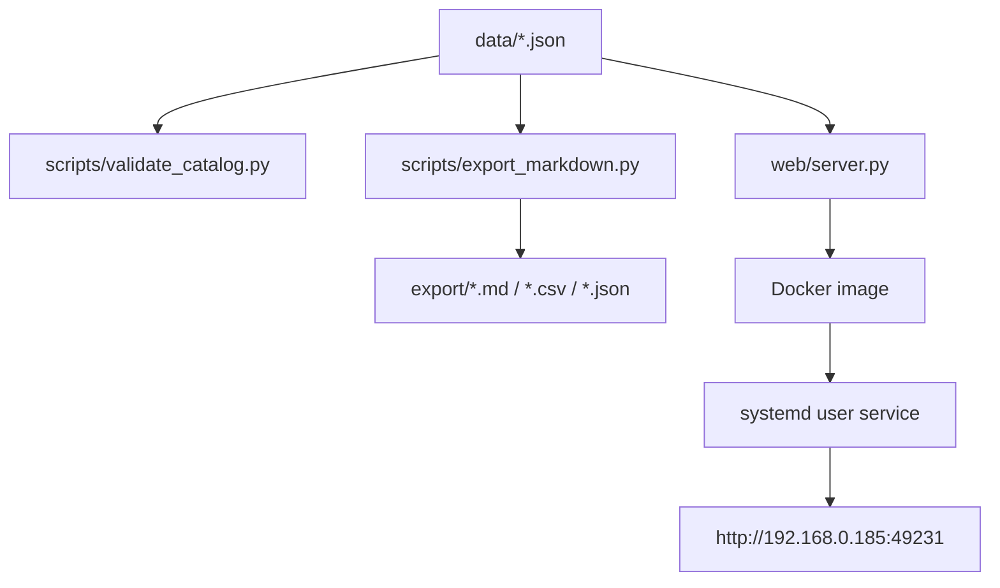
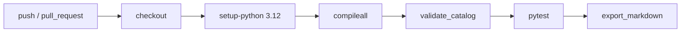

# 技術スタック

この文書はIT部門・開発者向けです。README本体は、非エンジニアや土木建設関係者向けの利用説明に集中しています。

## 構成



## ディレクトリ

```text
data/                 台帳JSONと接続検証結果
docs/                 方針・計画・技術ドキュメント
export/               自動生成される成果物
samples/requests/     curl等のサンプルリクエスト
samples/responses/    最小化したサンプルレスポンス
scripts/              検証・出力・接続サンプル
tests/                自動テスト
tests/e2e/            Playwright ブラウザ E2E（`-m e2e` で実行・通常CIでは除外）
web/                  Web UIとJSON API
data/demo/            MVPデモ用の架空データ（本番台帳とは分離）
deploy/               固定ポート、systemdユーザーサービス設定
```

## ローカル検証

Python 3.12以上を使用します。テスト実行には `pytest` が必要です。

```bash
python -m pip install pytest
make check
```

`make check` は次を実行します。

1. Python構文チェック
2. 台帳データ検証
3. 自動テスト
4. Markdown/CSV/JSON成果物出力

個別実行:

```bash
python scripts/validate_catalog.py
python scripts/export_markdown.py
python scripts/run_verification.py --limit 10
```

実HTTPアクセスを伴う接続検証は、明示的に `--live` を付けた場合のみ実行します。

```bash
python scripts/run_verification.py --live --limit 10 --timeout 15
```

## Web UI

Dockerコンテナ内では8080番で待ち受け、ホストでは固定ポート49231で公開します。

```bash
docker build -t global-civil-api-catalog-web:local .
docker run --rm -p 49231:8080 global-civil-api-catalog-web:local
```

systemdユーザーサービス:

```bash
mkdir -p ~/.config/systemd/user
cp deploy/global-civil-api-catalog-web.service ~/.config/systemd/user/
systemctl --user daemon-reload
systemctl --user enable --now global-civil-api-catalog-web.service
```

Exportファイルは `/api/export` で一覧を返し、`/exports/<filename>` で表示、`/exports/<filename>?download=1` で添付ファイルとしてダウンロードします。

## CI

GitHub Actionsは `.github/workflows/validate.yml` で定義しています。

追加で `.github/workflows/e2e.yml` が Playwright E2E（静的UI + フルスタック承認フロー）を実行します。
E2E はデフォルトの pytest から除外され、`python -m pytest -m e2e` で明示実行します。



## セキュリティ

- APIキー、トークン、Cookie、個人情報、本番データは保存しません。
- APIキーが必要なデータソースは `skipped` として扱います。
- サンプルレスポンスは最小化し、バイナリや大容量データは保存しません。
